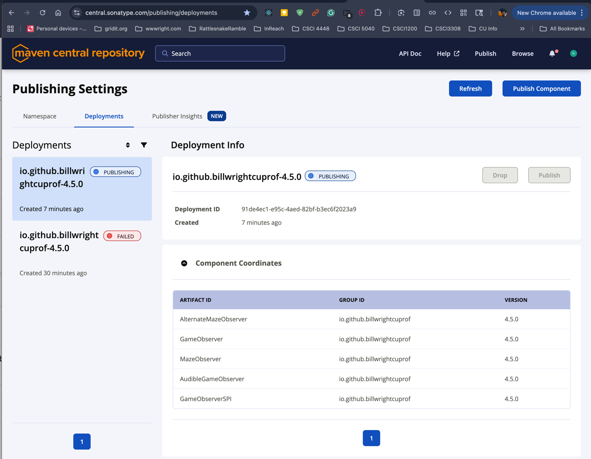
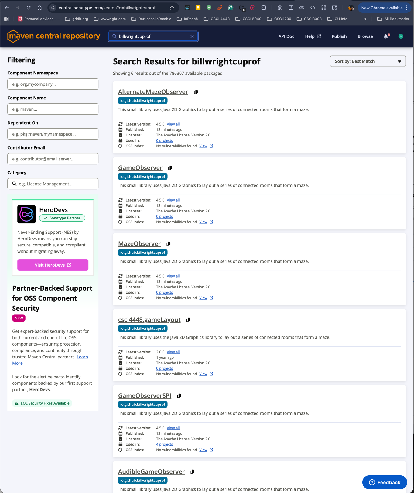

# Maven Central Publishing Notes

This file is a reminder for how to publish the artifacts in this repository to Maven Central.

## Published artifacts

This project publishes these modules as separate Maven artifacts:

- `GameObserverSPI`
- `GameObserver`
- `MazeObserver`
- `AlternateMazeObserver`
- `AudibleGameObserver`

## Artifact coordinates

Artifacts are published under:

text groupId: io.github.billwrightcuprof version:

Example dependency:

groovy repositories { mavenCentral() }
dependencies { implementation 'io.github.billwrightcuprof:MazeObserver:4.5.0' }

If a consumer directly uses SPI interfaces, it may also need:
groovy dependencies { implementation 'io.github.billwrightcuprof:GameObserverSPI:4.5.0' }

## One-time setup

### 1. Create a Sonatype Central Portal account

Use:
text [https://central.sonatype.com/](https://central.sonatype.com/)

### 2. Verify the namespace

The namespace for this project is:
text io.github.billwrightcuprof

This must be verified in the Central Portal before publishing.

### 3. Install GPG on macOS
bash brew install gnupg

### 4. Create a GPG key
bash gpg --full-generate-key

Recommended choices:

- key type: `RSA and RSA`
- key size: `4096`

### 5. Find the key ID
bash gpg --list-secret-keys --keyid-format=long

Use the key ID from the `sec` line.

### 6. Publish the public key to a key server
bash gpg --keyserver keyserver.ubuntu.com --send-keys <key-id>

bash gpg --keyserver keyserver.ubuntu.com --send-keys <KEY_ID> gpg --keyserver keys.openpgp.org --send-keys <KEY_ID>

If Central reports that it cannot find the public key, wait for propagation and then retry publishing.

### 7. Create a Central Portal user token

In the Central Portal account settings, generate a **user token**.

Use the generated token username and token password for Gradle publishing.

Do **not** use the normal website login password.

## Local Gradle configuration

Put the publishing credentials in:

text ~/.gradle/gradle.properties

Example:

properties mavenCentralUsername=<central-token-username> mavenCentralPassword=<central-token-password>
signing.gnupg.keyName=<gpg-key-id> signing.gnupg.passphrase=<gpg-passphrase> signing.gnupg.executable=/opt/homebrew/bin/gpg

Find the GPG executable path with:

bash which gpg

## Gradle build configuration notes

This project uses:

- the `com.vanniktech.maven.publish` plugin for Maven Central publishing
- GPG command-line signing via Gradle
- Central Portal user token credentials

The build must be configured so that signing uses the local GPG command.

## Publishing workflow

### 1. Update the version

Before each release, update the project version.

### 2. Test signing

bash ./gradlew :AlternateMazeObserver:signMavenPublication

If this fails, check:

- GPG is installed
- `signing.gnupg.executable` points to the correct `gpg`
- the key ID matches the `sec` key
- the passphrase is correct

### 3. Publish to Maven Central

bash ./gradlew publishToMavenCentral

### 4. Check Central Portal validation results

If publishing succeeds but validation fails, inspect the exact component validation message in the Central Portal.

## Common problems

### Gradle wrapper error

If Gradle reports:

text Could not find or load main class org.gradle.wrapper.GradleWrapperMain

then the Gradle wrapper files are missing or broken.

### No configured signatory

If Gradle reports:
text Cannot perform signing task ... because it has no configured signatory

then Gradle signing is not configured to use GPG command signing.

### Problem starting process `gpg`

If Gradle reports:
text A problem occurred starting process 'command 'gpg''

then Gradle cannot find the `gpg` executable.

Set this in `~/.gradle/gradle.properties`:
text signing.gnupg.executable=/opt/homebrew/bin/gpg

where `/opt/homebrew/bin/gpg` is the path to the `gpg` executable.

### Could not read PGP secret key

If Gradle reports:

text Could not read PGP secret key

then the in-memory key configuration is wrong.

The simpler approach is to use local GPG command signing instead of `signingInMemoryKey`.

### Invalid token

If Maven Central reports:

text Invalid token

then the Central Portal credentials are wrong.

Use the generated **user token** username and password, not the normal website login.

### Public key not found

If Maven Central reports:

text Invalid signature ... Could not find a public key by the key fingerprint

then the public key has not been uploaded to a supported public key server, or it has not propagated yet.

Upload the public key and wait before retrying.

## Release checklist

Before publishing a new version:

- update the version
- confirm the namespace is verified
- confirm the Central Portal user token is valid
- confirm the GPG key is available locally
- confirm the public key has been uploaded to a public key server
- run:

bash ./gradlew :AlternateMazeObserver:signMavenPublication

- run:

bash ./gradlew publishToMavenCentral

Important: `./gradlew publishToMavenCentral` only confirms that the bundle was uploaded.
A release is not complete until the Central Portal shows successful validation/publication and the artifacts are resolvable from Maven Central.

## Local development notes

For local development across projects, a composite build can still be useful:

groovy if (file('../CSCI4448GameLayout').exists()) { includeBuild('../CSCI4448GameLayout') }

That is mainly for local development convenience, not for student use.

For students and other consumers, the preferred approach is to depend on the published Maven Central artifacts.

